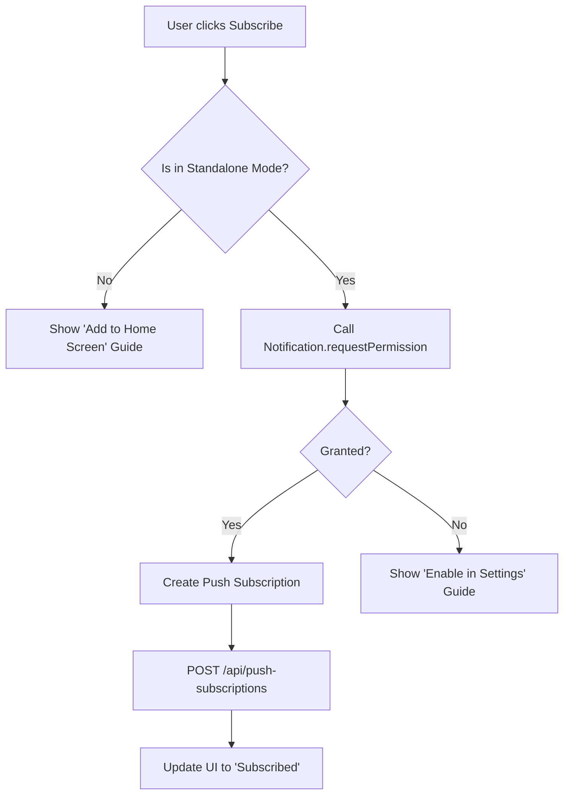

# UI/UX Analysis: Push Notifications Integration

## Overview
This document outlines the user experience and interface design for implementing push notifications in baseweb, with a specific focus on the stringent requirements of iOS Safari and PWA (Progressive Web App) environments.

## Constraints & Technical Requirements

### 1. iOS Safari Specifics
Apple's implementation of the Push API has critical constraints that dictate the UX flow:
- **Standalone Mode Required**: Push notifications are only available when the application is launched from the home screen as an installed PWA.
- **User-Initiated Trigger**: The `Notification.requestPermission()` call MUST be triggered by a direct user action (e.g., a button click). Automatic prompts on page load are blocked.
- **Browser Limitations**: Standard Safari tabs, Chrome on iOS, and Firefox on iOS do not support push notifications.

### 2. General Requirements
- **VAPID Integration**: The frontend must fetch the VAPID public key from the backend to initialize the push subscription.
- **Service Worker**: A registered and active service worker is required to handle push events in the background.

---

## User Journeys

### Journey A: The "Happy Path" (Installed PWA)
1. **Installation**: User visits baseweb in Safari $\rightarrow$ clicks "Share" $\rightarrow$ "Add to Home Screen".
2. **Launch**: User opens baseweb from the home screen icon.
3. **Discovery**: User navigates to "Settings" or a "Notifications" prompt.
4. **Action**: User clicks the **"Enable Notifications"** button.
5. **Permission**: System prompt appears $\rightarrow$ User selects "Allow".
6. **Confirmation**: UI updates to "Subscribed" state with a success message.
7. **Reception**: User receives a system notification while the app is closed.

### Journey B: The "Unsupported" Path (Standard Browser)
1. **Access**: User visits baseweb via a standard Safari tab or another iOS browser.
2. **Discovery**: User navigates to the notification settings.
3. **Detection**: The app detects it is not in standalone mode.
4. **Guidance**: Instead of a "Subscribe" button, the user sees an information card:
   - **Message**: "Push notifications are only available in the installed app."
   - **Call to Action**: A small guide/tooltip showing how to "Add to Home Screen".
5. **Prevention**: The subscription button is disabled or hidden to prevent a failing API call.

### Journey C: Permission Denied
1. **Action**: User clicks "Enable Notifications".
2. **Decision**: User selects "Don't Allow" on the system prompt.
3. **Feedback**: UI displays a warning: "Notifications are disabled. Please enable them in your system settings to receive updates."
4. **Recovery**: Provide a link or instructions on how to reset notification permissions in iOS Settings.

---

## UI Design Specifications

### 1. The Subscription Component
A dedicated UI element (likely in a User Settings page or a welcome onboarding flow).

#### State: Not Subscribed (PWA Mode)
- **Element**: Primary Action Button.
- **Label**: "Enable Push Notifications".
- **Icon**: Bell icon (outline).
- **Helper Text**: "Get instant updates about your data and alerts."

#### State: Subscribed
- **Element**: Secondary/Ghost Button or Toggle.
- **Label**: "Notifications Enabled".
- **Icon**: Bell icon (filled/checked).
- **Action**: Change to "Disable Notifications" to allow the user to unsubscribe.

#### State: Unsupported (Browser Mode)
- **Element**: Information Alert (Vuetify `v-alert` with `type="info"`).
- **Content**: "To receive notifications, please add this app to your Home Screen."
- **Visual**: Include a "How to install" helper.

### 2. Feedback Mechanisms
- **Loading State**: While waiting for the Push API and backend response, show a loading spinner on the button.
- **Success State**: A temporary snackbar: "You are now subscribed to notifications!"
- **Error State**: A snackbar or inline error: "Unable to enable notifications. Please try again later."

---

## Interaction Design

### The Permission Flow

---

## API Dependencies

The UI relies on the following backend endpoints (from task-6.2):
- `GET /api/vapid-public-key`: To obtain the key required for `registration.pushManager.subscribe()`.
- `POST /api/push-subscriptions`: To send the subscription object to the server.
- `DELETE /api/push-subscriptions`: To remove the subscription when the user unsubscribes.

## Acceptance Criteria (UX Perspective)

- [ ] The "Subscribe" button only triggers the permission prompt on a direct click.
- [ ] Users in standard browser tabs are clearly informed why they cannot subscribe and how to fix it (Install PWA).
- [ ] The UI clearly distinguishes between "Not Subscribed", "Subscribed", and "Permission Denied" states.
- [ ] Loading indicators are present during the asynchronous subscription process.
- [ ] The transition from "Browser" $\rightarrow$ "PWA" $\rightarrow$ "Subscribed" is intuitive and frictionless.
