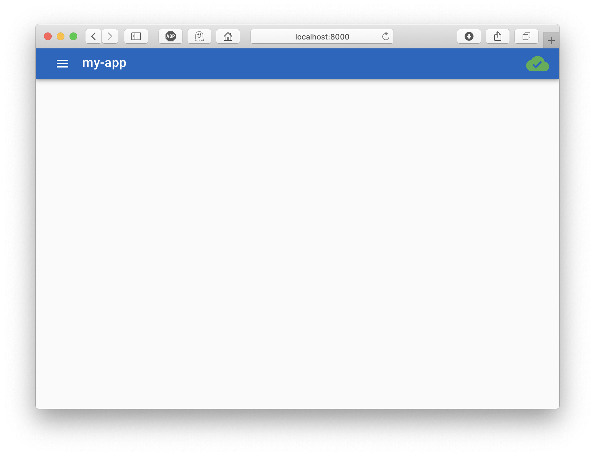
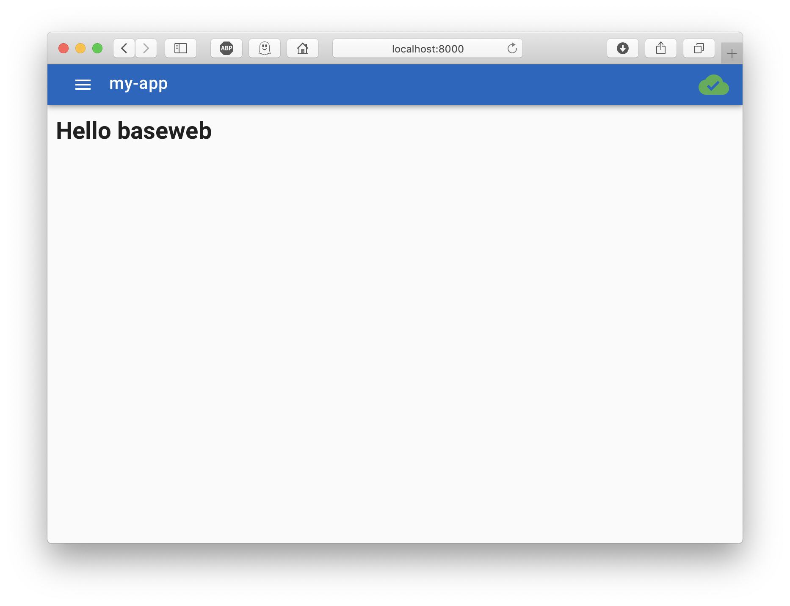
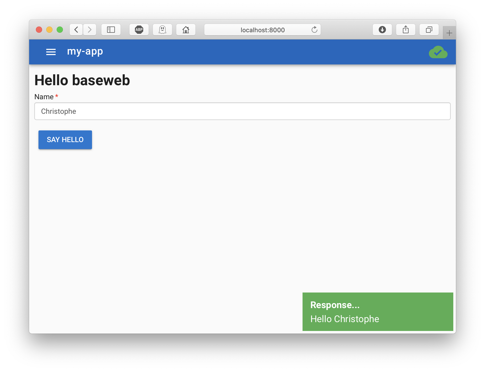

# Building Your First baseweb App

The following walkthrough starts from literally nothing and shows every step to get to the standard demo app, as can be found in [https://github.com/christophevg/baseweb-demo](https://github.com/christophevg/baseweb-demo).

> Well, nothing is maybe too little. I assume you have access to a computer with a command line, python and ideally some virtual environment manager. Oh, and in all honesty, you might also want a browser ;-)

## Setup an environment

This is optional, still very much advised: prepare a suitable execution environment, with your favorite virtual environment runner - mine is PyEnv:

```console
% mkdir my-app
% cd my-app
% pyenv virtualenv my-app
% pyenv local my-app
```

## Getting baseweb

```console
% pip install baseweb
```

This is enough to install baseweb. Now to run your first baseweb app, you will need a webserver, like `gunicorn` with `eventlet` support:

```bash
% pip install https://github.com/benoitc/gunicorn/archive/ff58e0c6da83d5520916bc4cc109a529258d76e1.zip#egg=gunicorn==20.1.0
% pip install eventlet==0.33.2
```

(There's an issue requiring these specific versions: [https://stackoverflow.com/questions/67409452/gunicorn-importerror-cannot-import-name-already-handled-from-eventlet-wsgi](https://stackoverflow.com/questions/67409452/gunicorn-importerror-cannot-import-name-already-handled-from-eventlet-wsgi))

All set. Let's meet baseweb...

## Hello baseweb

You can simply run baseweb from your app folder:

```console
% gunicorn -k eventlet -w 1 baseweb.web:server
[2020-06-27 12:40:24 +0200] [68179] [INFO] Starting gunicorn 20.1.0
[2020-06-27 12:40:24 +0200] [68179] [INFO] Listening at: http://127.0.0.1:8000 (68179)
[2020-06-27 12:40:24 +0200] [68179] [INFO] Using worker: eventlet
[2020-06-27 12:40:24 +0200] [68182] [INFO] Booting worker with pid: 68182
```

And visit [http://localhost:8000](http://localhost:8000)...



Notice that baseweb has take the name of your app folder and uses that as the name for the application. That is in fact a fall-back in case the name isn't provided as an enrionment variable. Try starting baseweb using the following command:

```bash
% APP_NAME=hello gunicorn -k eventlet -w 1 baseweb.web:server
```


## Hello myapp

Although there is already a lot in your current browser window to talk about, running baseweb in this 'naked' form, results in pretty much an empty frame. Let's build our actual app on top of "baseweb as a Python module".

Create a file, `hello.py`:

```python
import os

from baseweb.web       import server
from baseweb.interface import register_component

register_component("hello.js", os.path.dirname(__file__))
```

And also create a Javascript file, `hello.js`:

```javascript
var Hello = {
  template : `
<div>
  <h1>Hello baseweb</h1>
</div>
`
};

router.addRoutes([
  { path: '/', component: Hello },
])
```

Now run your own baseweb app:

```bash
% gunicorn -k eventlet -w 1 hello:server
```



So what did you just do? You created a Vue.js component (`Hello`), registered it with baseweb, which hosts it in its, previously empty, Vuetify-enabled frame, and shows it when the 'route' points to the 'root'.

> There is a lot to discover and do with Vue.js. Baseweb leverages this enormous amount of power by wrapping a lot of the boilerplate in a way that it can be structured from Python. From there on, its mostly Vue.js magic for you to explore ;-)

## Hello &lt;insert your name here&gt;

Now, extend your `hello.py` with

```python
# set up a REST resource to handle hello requests from the UI

from flask import request
from flask_restful import Resource

from baseweb.rest import api

class Hello(Resource):
  def get(self):
    name = request.args["name"]
    return "Hello {0}".format(name)

api.add_resource(Hello, "/api/hello")
```

and update your `hello.js` to look like this:

```javascript
var Hello = {
  template : `
<div>
  <h1>Hello baseweb</h1>
  <vue-form-generator ref="vfg" :schema="schema" :model="model"></vue-form-generator>
  <v-btn @click="send_get()" class="primary">say hello</v-btn>
</div>
`,
  methods: {
    send_get: function() {
      $.get( "/api/hello", { "name" : this.model.name }, function( response ) {
        app.$notify({
          group: "notifications",
          title: "Response...",
          text:  response,
          type:  "success",
          duration: 10000
        });
      });
    }
  },
  data: function() {
    return {
      model: {
        name: ""
      },
      schema: {
        fields: [
          {
            type: "input",
            inputType: "text",
            label: "Name",
            model: "name",
            placeholder: "Your name",
            validator: VueFormGenerator.validators.string
          }
        ]
      }
    }
  }
};

router.addRoutes([
  { path: '/', component: Hello },
])
```

Run it again and now enter your name and this the button...



And there you have it, your first baseweb app: 66 lines of code provide you with a modern UI experience, generated forms, basic IO,...

## And There is More Where That Came From...

Replacing/adding post behaviour is rather straightforward given the get behaviour example.

Besides the more classic IO, baseweb als includes ready-to-use socket IO. Add the following snippets to your code files to see it in action:

```python
# set up socketio event handlers to handle hello events from the UI

from baseweb.socketio import socketio

@socketio.on("hello")
def on_hello(name):
  return "Hello {0} from socketio!".format(name)
```

```javascript
  // in your component's HTML template
  template : `
    ...
    <v-btn @click="send_socketio()" class="primary">say hello socket</v-btn>
  `

  // next to send_get
  send_socketio: function() {
    socket.emit("hello", this.model.name, function(response) {
      app.$notify({
        group: "notifications",
        title: "Response...",
        text:  response,
        type:  "success",
        duration: 10000
      });        
    });
```

## At the End of This Tour...

... you are ready to take a look at the [baseweb demo app](https://github.com/christophevg/baseweb-demo), and see that, given some additional nuts and bolts, you basically have compiled the entire demo app yourself.

Make sure to look into [adding security](adding-security.md) in the mix and watch this documentation for more examples in the future or consider [contributing](contributing.md) in any way.
