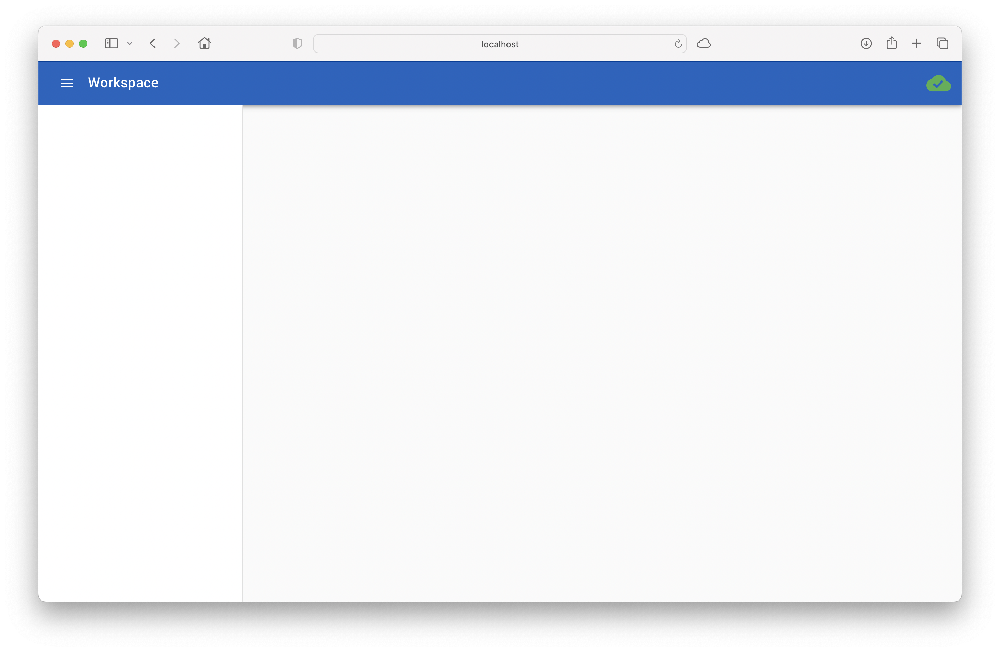

# Getting Started

Baseweb is hosted on PyPi, so...

```bash
$ pip install baseweb
```

## Minimal Survival Commands

To actually run baseweb you need additionally a web server, like gunicorn, optionally with async support, e.g. using eventlet.

```bash
$ pip install gunicorn eventlet
```

Now you can start a stock baseweb using:

```bash
$ gunicorn -k eventlet -w 1 baseweb.web:server
```

And when you visit [http://localhost:8000](http://localhost:8000) you will get...



Which is an empty baseweb, serving a (non-existing) application from your current folder (in my case called Workspace). This is the baseweb frame in which your pages can be injected.

## A little more...

To quickly add a little more, clone the baseweb-demo repository and give that a spin...

```bash
% git clone https://github.com/christophevg/baseweb-demo
% pip install oatk
% gunicorn -k eventlet -w 1 baseweb-demo:server
```

Now visit [http://localhost:8000](http://localhost:8000) again, enter your name and press a few buttons to see the demo app in action, presenting some of the standard features offered by baseweb.


Finally inspect the `baseweb-demo/` folder to see how to build the application or read on for a step by step walk through of [building your first baseweb app](building-your-first-baseweb-app.md).

> Pro-Tip: you can always clone/fork the `baseweb-demo` repository to start a new baseweb application ;-)
