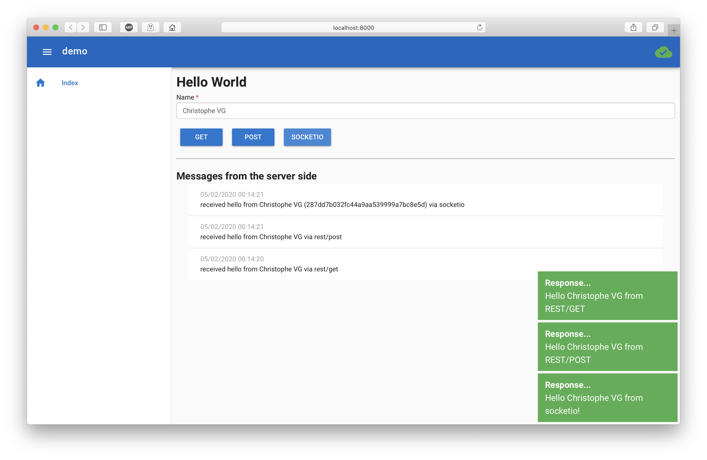

# Getting Started

Baseweb is hosted on PyPi, so...

```bash
$ pip install baseweb
```

## Minimal Survival Commands

From the repository...

```bash
$ make
*** building a virtual environment
Running virtualenv with interpreter /Library/Frameworks/Python.framework/Versions/3.5/bin/python3
Using base prefix '/Library/Frameworks/Python.framework/Versions/3.5'
New python executable in /Users/xtof/Workspace/baseweb/venv/bin/python3
Also creating executable in /Users/xtof/Workspace/baseweb/venv/bin/python
Installing setuptools, pip, wheel...
done.
*** setting up requirements
*** starting the web container
[2020-02-05 00:12:11 +0100] [51457] [INFO] Starting gunicorn 20.0.4
[2020-02-05 00:12:11 +0100] [51457] [INFO] Listening at: http://127.0.0.1:8000 (51457)
[2020-02-05 00:12:11 +0100] [51457] [INFO] Using worker: eventlet
[2020-02-05 00:12:11 +0100] [51461] [INFO] Booting worker with pid: 51461
[2020-02-05 00:12:11 +0100] [baseweb.config] [51461] [DEBUG] baseAdmin config = {'app': {'author': 'Christophe VG', 'root': '/Users/xtof/Workspace/baseweb', 'name': 'demo', 'description': 'A demo app for baseweb'}}
[2020-02-05 00:12:11 +0100] [baseweb.web] [51461] [INFO] baseweb web server is ready...
[2020-02-05 00:12:11 +0100] [baseweb.interface] [51461] [INFO] registered component index.js from /Users/xtof/Workspace/baseweb/demo/pages/index
```

Now visit [http://localhost:8000](http://localhost:8000), enter your name a press some buttons...



Finally inspect the `demo/` folder to see how to build the application.

More to come...
