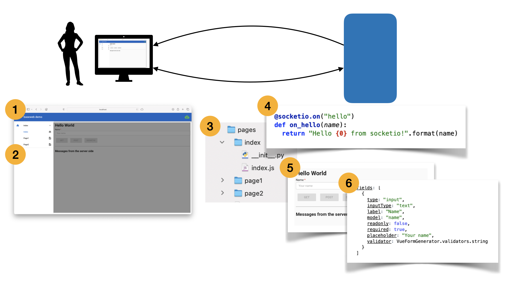

# What's in The Box?

From a pure technical point of view the following list answers the question:

* a lot of Vue goodness
  * Vuetify + Material Design
  * Router
  * VueX
  * Notification
  * Form Generation
  * Chart.js
  * ...
* support for RESTful and SocketIO communication

From a functional point of view baseweb is a rapid prototyping framework, highly convention driven, with a simple application architecture that focuses on quickly offering access to data in a consistent way.

1. To acchieve this, baseweb provides an application frame, based on Vuetify with a Material Design look & feel.
2. To this frame, pages can be added, which are linked from the navigation panel and are integrated in an application router.
3. A page consists of a Python backend module and a Vue web component.
4. The Python module typically defined RESTful or socketio routes to answer calls from the page inside the frame.
5. The Vue web component leverages all the goodies that Vue, Vuetify, Vuex, Notifications,... to construct a user friendly and consistently designed page.
6. Through extensive use of Vue From Generator and a growing library of components, assembling such a page requires little to no coding.
